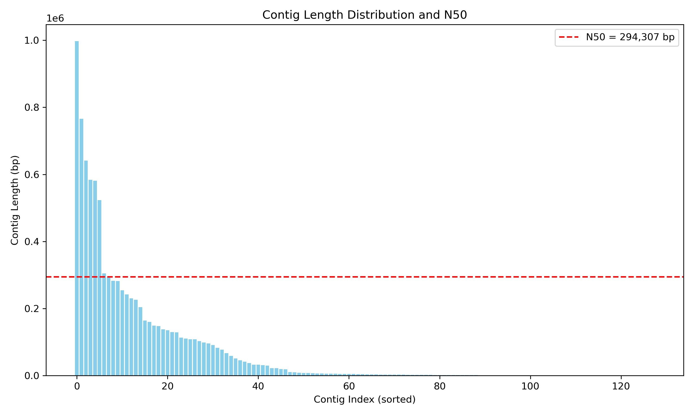

# Final-project_-811

# Project Name: Bacterial Genome Assembly

    Group Members: Popy Rani Debi, Ramesh JayaKumar

# Background
    In this project, Illumina HiSeq 2500 paired-end sequencing data (250 bp) was utilized to generate raw sequence data. The dataset consists of four FASTQ files:
       - Two forward reads (denoted "R1")
       - Two reverse reads (denoted "R2")

    The goal of the project is to: 
      1. Familiarize with various bioinformatics tools.
      2. Work through the sequencing pipeline.
      3. Reconstruct the raw sequencing data at chromosome-level resolution.
      4. To determine various aspects of the initial raw reads from counting the total number of reads to visualization of the reads.
   

# Flowchart 
                      +-------------------+
                      |   Raw Reads       |
                      +-------------------+
                               |
                               v
                      +-------------------+
                      | Read Quality      |
                      |    (FASTQC)       |
                      +-------------------+
                               |
                               v
                +----------------------------+
                | Read Trimming and Filtering|
                |     (Trimmomatic)          |
                +----------------------------+
                               |
                               v
                      +-------------------+
                      |     FASTQC        |
                      +-------------------+
                               |
                               v
                      +-------------------+
                      | Genome Assembly   |
                      |    (SPAdes)       |
                      +-------------------+
                               |
                               v
                      +-------------------+
                      |      FASTA        |
                      +-------------------+
                               |
                               v
                +----------------------------+
                |     Genome Annotation      |
                |         (PROKKA)           |
                +----------------------------+
                               |
                               v
                +----------------------------+                    
                |   Expected Gene Content    |
                |           (BUSCO)          |                    
                +----------------------------+
                               |
               +-----------------------------+
               |      Genome Contiguity      | 
               |            (QUAST)          |
               +------------------------------
                               |
                               v
               +-----------------------------+
               |      Taxonomic Assignment   |
               |           (BLAST)           | 
               +-----------------------------+
                               |
                               v
                +----------------------------+
                |       Read Mapping         |                     +-----------------------+ 
                |                            |---------------------|  Comparative Genomics |
                |  (Genome Coverage, BWA)    |                     +-----------------------+
                +----------------------------+
                             |
                             v
                +---------------------------+
                |    Genome Filtering       |
                |     (BlobTools)           |
                +---------------------------+
                               |
                               v
                      +-------------------+
                      |  Filtered Genome  |
                      +-------------------+
                               |
                               V
                      +-------------------------+
                      |  Genome Visualization   |
                      |       (python)          |
                      |                         |
                      +-------------------------+

# Software tools

       1. FASTQC (version: v0.12.1)

             -- FASTQC is a standard tool used for assessing the quality of sequencing reads before proceeding with high-throughput analysis.
             -- It was used both before and after trimming to evaluate the quality of raw reads and trimmed reads.
             -- Provides summary reports with visual plots showing per-base quality scores, GC content, adapter content, duplication levels, etc.

       2. Trimmomatic (Version: 0.39)

             -- Trimmomatic is a flexible and efficient tool used to trim Illumina sequencing reads, removing adapters and low-quality sequences.
             -- Detects and removes adapter contamination.
             -- Applied to raw FASTQ files to clean up the reads prior to genome assembly or alignment.               

       3. SPAdes (Version: v4.0.0)
           
             -- A versatile genome assembler designed primarily for Illumina sequencing data.
             -- Input: Trimmed paired and unpaired FASTQ reads.
             -- Output: Assembled genome in FASTA format, suitable for downstream analysis.

       4. PROKKA (Version: 1.14.6)
              
             -- Provides fast and efficient annotation of de novo assembled prokaryotic genomes
             -- Generates a wide range of useful files with priliminary genome_assembly file and after filtering, the final_fasta file including .gff, .gbk, .faa, .fna, .ffn, .tbl, and .sqn, which are ready for visualization, editing, or submission to public databases like GenBank.

       5. BUSCO (Version: 5.4.6) 
          
            -- Used to evaluate the completeness of genome assembiles and the annotated gene products. 
            -- It works by comparing the given sequences against the dataset from orthoDB, where universal genes present in a single copies with lineage. 
            -- It provides output in on the basis of completness (single-copy, dublicated, fragmented or missing)
 
       6. QUAST (Version: 5.2.0)
               
            -- Used to assess the quality of genome assemblies and provides stats about how well a genome constructed from the sequence.
            -- It provides output including the total number of contigs, largest contig length with N50 and GC content.

      7. BLAST (Version: 2.15.0+)
        
            -- NCBI BLAST tool is used to compare the assembled sequence against database to find similar sequences.
            -- It provides details such as % identity, alignment length, E-value and bit score.
            -- BLASTn with the final filtered_file helps to detect the contamination of contigs against known sequences from UniVec.

      8. SAM & BAM (samtools version: 1.18; bamtools version: 2.5.2) 

             -- SAM/BAM files are used to assess assembly quality by aligning sequencing reads back to the assembled contigs
             -- BAM files provide coverage information, showing how well each region of the assembly is supported by reads.
             -- BlobTools then uses BAM-based coverage along with taxonomic BLAST results to identify and filter out potential contaminants.
         
# Results
       
## N50 graph
      

                  

# Reference

1) Alexey Gurevich, Vladislav Saveliev, Nikolay Vyahhi and Glenn Tesler, QUAST: quality assessment tool for genome assemblies, Bioinformatics (2013) 29 (8): 1072-1075. doi: 10.1093/bioinformatics/btt086 First published online: February 19, 2013
2) Altschul, S F et al. “Basic local alignment search tool.” Journal of molecular biology vol. 215,3 (1990): 403-10. doi:10.1016/S0022-2836(05)80360-2
3) Andrews S., A quality control tool for high throughput sequence data. 2010. http://www.bioinformatics.babraham.ac.uk/projects/fastqc/. (11 November 2016, date last accessed).
4) Bolger, A. M., Lohse, M., & Usadel, B. (2014). Trimmomatic: A flexible trimmer for Illumina Sequence Data. Bioinformatics, btu170.
5) Heng Li, Bob Handsaker, Alec Wysoker, Tim Fennell, Jue Ruan, Nils Homer, Gabor Marth, Goncalo Abecasis, Richard Durbin, 1000 Genome Project Data Processing Subgroup, The Sequence Alignment/Map format and SAMtools, Bioinformatics, Volume 25, Issue 16, August 2009, Pages 2078–2079, https://doi.org/10.1093/bioinformatics/btp352
6) Li H. and Durbin R. (2009) Fast and accurate short read alignment with Burrows-Wheeler transform. Bioinformatics, 25, 1754-1760. [PMID: 19451168]
7) Mosè Manni, Matthew R Berkeley, Mathieu Seppey, Felipe A Simão, Evgeny M Zdobnov, BUSCO Update: Novel and Streamlined Workflows along with Broader and Deeper Phylogenetic Coverage for Scoring of Eukaryotic, Prokaryotic, and Viral Genomes, Molecular Biology and Evolution, Volume 38, Issue 10, October 2021, Pages 4647–4654, https://doi.org/10.1093/molbev/msab199
8) Prjibelski, A., Antipov, D., Meleshko, D., Lapidus, A. and Korobeynikov, A., 2020. Using SPAdes de novo assembler. Current protocols in bioinformatics, 70(1), p.e102. doi.org/10.1002/cpbi.102
9) Torsten Seemann, Prokka: rapid prokaryotic genome annotation, Bioinformatics, Volume 30, Issue 14, July 2014, Pages 2068–2069, https://doi.org/10.1093/bioinformatics/btu153
10) https://www.google.com/url?sa=t&rct=j&q=&esrc=s&source=web&cd=&cad=rja&uact=8&ved=2ahUKEwj3lOvE4ZyNAxVxlYkEHQ3-B2wQFnoECBsQAQ&url=https%3A%2F%2Fgithub.com%2Fablab%2Fspades&usg=AOvVaw2912BMAGI5I8vZ59pL_56_&opi=89978449
11) https://www.bing.com/ck/a?!&&p=b0008d55403adc16fd9555b0e5963ac925ecd6dfcf40d1ffad8760157837a785JmltdHM9MTc0NjkyMTYwMA&ptn=3&ver=2&hsh=4&fclid=0eddd476-cbbe-6669-0a71-c1bdcadf67e9&psq=trimmomatic&u=a1aHR0cHM6Ly9naXRodWIuY29tL3VzYWRlbGxhYi9UcmltbW9tYXRpYw&ntb=1

